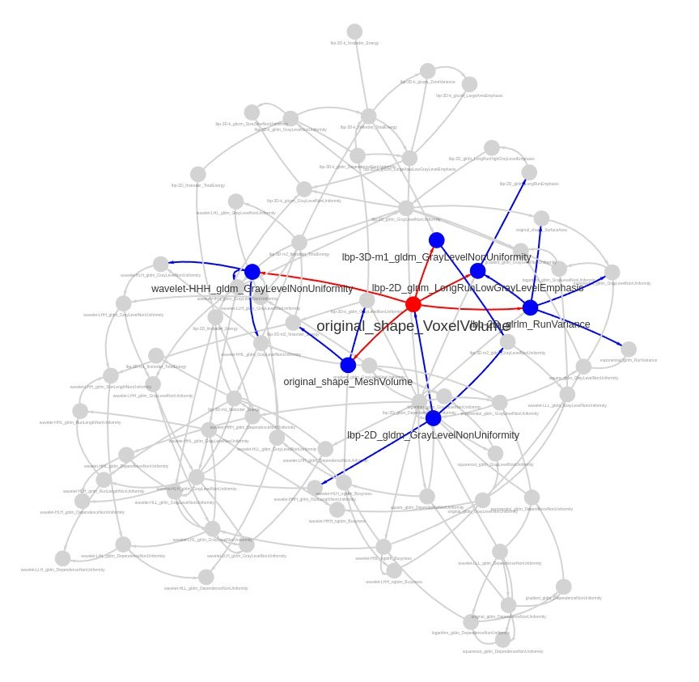

# RadiomiXAI: A Radiomics Foundation Model for Addressing Feature Importance Confounding

This repository contains the implementation of the framework proposed in the paper **"RadiomiXAI: A Radiomics Foundation Model for Addressing Feature Importance Confounding"**.

## Overview

Radiomics features are often highly intercorrelated due to latent factors such as tumor volume. This multicollinearity can distort feature importance estimates in machine learning models and limit their clinical interpretability.

**RadiomiXAI** is a model-agnostic explainability framework built on a Bayesian-network-based radiomics foundation model. Decoupling the resource-intensive global dependency mapping from downstream tasks, it learns global feature dependencies to derive uncertainty bounds (confidence intervals) for perturbation-based feature importance estimates (e.g., in a LightGBM classifier). This approach addresses feature importance distortion and reveals latent confounding that standard normalization methods fail to resolve.

## Workflow



## Repository Structure

- `code/BN_radiomis.py`: Performs correlation analysis, discretizes feature values, runs Bayesian Network structure and parameter learning, calculates mutual-information-weighted edges, and generates interactive network visualizations with Pyvis.
- `code/Classifier.py`: Implements LightGBM training and grid search for glioma grading, computes perturbation-based importance for features, and utilizes the Bayesian Network structure to compute confidence intervals for feature importance.
- `code/Cor_and_VIF_AcceleratedDL_v2.py`: GPU-accelerated (cuDF/cuML) script to evaluate correlations, apply various normalization techniques (z-score, min-max, log, and volume normalization), and compute Variance Inflation Factors (VIF) to assess multicollinearity.
- `code/Dataset.py`: Standard PyTorch `Dataset` pipeline to load, align, and normalize radiomics features.
- `code/Dataset_nonormalization.py`: PyTorch `Dataset` pipeline similar to `Dataset.py` but without feature normalization, used for raw data input.

## Dataset Setup

The dataset folders under `data/` need to hold the CSV files from the three datasets (**BraTS2020**, **BraTS2023**, and **NSCLC** / NCSLC). They can be downloaded from [openradiomics.org](https://openradiomics.org/).

## Requirements

To run this project, ensure you have the required GPU-accelerated and machine learning libraries installed (such as RAPIDS cuDF/cuML, PyTorch, LightGBM, networkx, pyvis, and bnlearn). 

Dependencies can be installed via:
```bash
pip install torch pandas numpy lightgbm bnlearn networkx pyvis openpyxl scikit-learn matplotlib
```
*Note: For GPU acceleration, RAPIDS (`cudf` and `cuml`) is required for running the correlation, VIF, and learning scripts.*

## Usage

1. **Feature Analysis and Normalization**:
   Run the correlation and VIF analysis script to evaluate multicollinearity under different normalization schemes:
   ```bash
   python code/Cor_and_VIF_AcceleratedDL_v2.py
   ```

2. **Bayesian Network Structure Learning**:
   Fit the Bayesian Network to identify global feature dependencies and save the model:
   ```bash
   python code/BN_radiomis.py
   ```

3. **Classifier Training and Confounding Assessment**:
   Train the LightGBM classifier, compute perturbation-based feature importance, and derive confidence intervals based on the learned Bayesian Network:
   ```bash
   python code/Classifier.py
   ```

## Citation

For more details, please refer to the 2nd International Conference on Cognitive Computing, Intelligence and Data Science Applications proceedings to access the full length paper.

## Contact

For any questions or inquiries, please contact the corresponding author:

Ernest (Khashayar) Namdar: me@ernestnamdar.com

## License

This project is licensed under the MIT License - see the [LICENSE](LICENSE) file for details.
